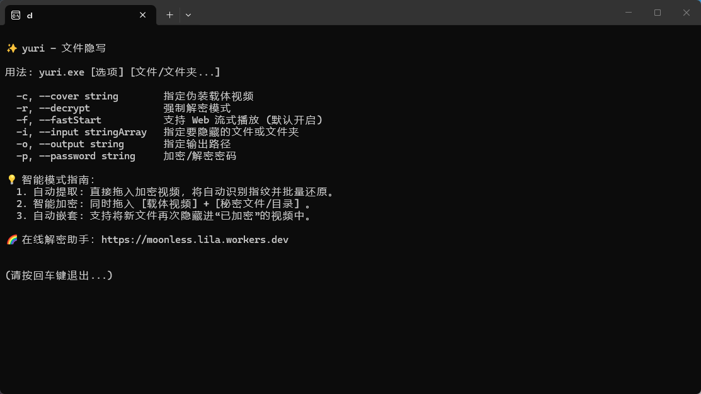
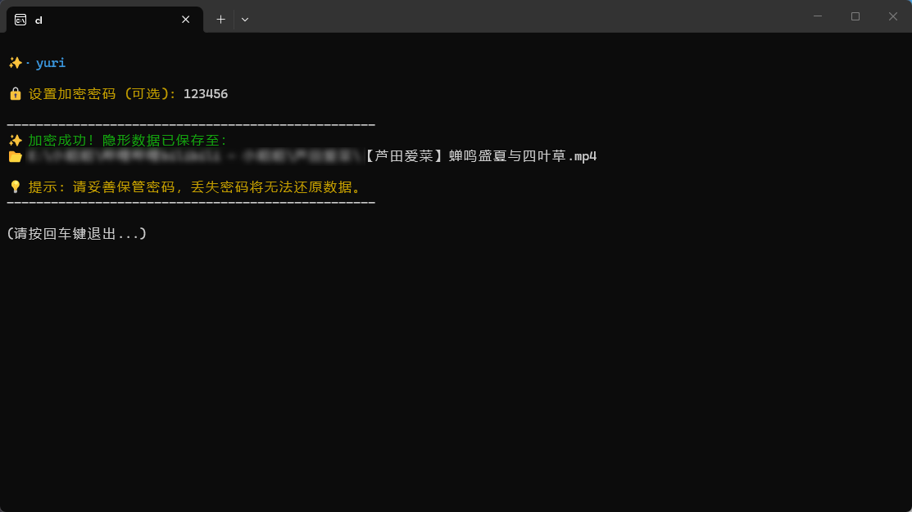
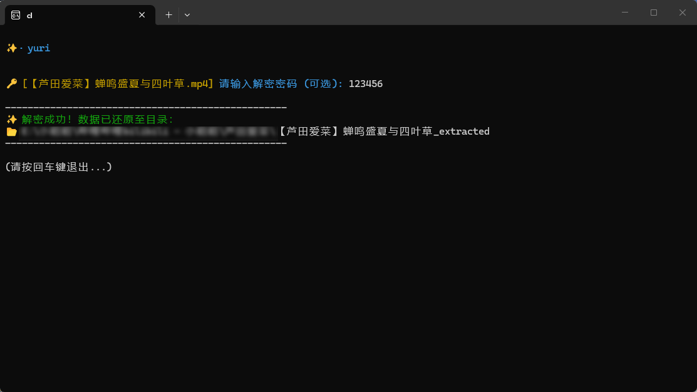
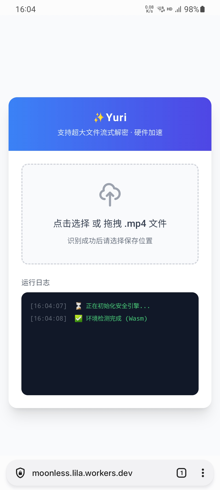
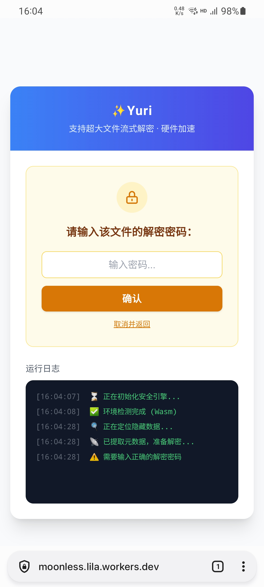
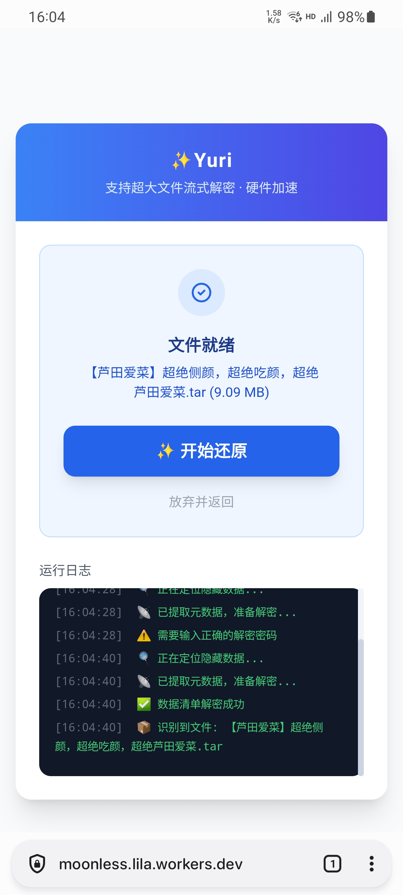

# ✨ yuri

**yuri** 是一款基于视频的隐写工具，支持在不破坏视频正常播放的前提下，实现秘密数据的深度隐藏。

---

## 🛠️ 核心功能

* **自动识别**：能够根据拖入的文件类型（普通视频、加密视频、待隐藏文件）自动判定执行“加密”还是“解密”。
* **免后缀修改**：加密后的视频保持标准 `.mp4` 格式，可像普通视频一样正常播放。
* **无需重复改名解压**：无需重复提取出一个巨大的压缩包后改名再进行二次解压，极大节省了时间与磁盘空间。
* **高容错数据保留**：如果在还原过程中遇到分块损坏或哈希校验失败，将尽可能保留已还原的数据片段。
* **跨平台解密**：支持通过[网页端离线解密](https://moonless.lila.workers.dev) (需要魔法)，随时随地提取秘密。

---

## 🖱️ 快速操作（Windows 拖拽）

### 1. 智能加密 (隐藏文件)
* **动作**：同时选中 **[一个载体视频]** 和 **[待隐藏的文件或目录]**。
* **操作**：将其一并拖入 `yuri.exe`。
* **说明**：支持**自动嵌套**，如果你拖入的是一个“已经加密过”的视频和新文件，程序会自动识别并完成嵌套加密。

### 2. 自动提取 (还原文件)
* **动作**：选中 **[已加密的视频]**。
* **操作**：单独将其拖入 `yuri.exe`。
* **说明**：程序将自动识别加密视频并执行批量还原。

---

## 📝 进阶说明

* **数据完整性校验**：还原过程包含 BLAKE3 哈希校验，确保提取的文件与原始数据一致。
* **安全性与密码**：
    * 默认使用内置的混淆密钥，实现“无感”加解密。
    * 支持通过 `-p` 参数或交互式提示设置自定义密码。

> [!CAUTION]
> **关于自定义密码**：程序基于 **HPKE** 强加密机制。若设置了自定义密码请务必牢记，密码丢失将导致数据永久无法还原。

### 验证信息
| 项目 | 内容 / 链接 |
| :--- | :--- |
| **SHA256** | `addeca3ace4f97da79fbfa61c00abe01566396e90bb2f0edad24301042fb88a3` |
| **VirusTotal** | [查看扫描报告](https://www.virustotal.com/gui/file/addeca3ace4f97da79fbfa61c00abe01566396e90bb2f0edad24301042fb88a3) |

---

